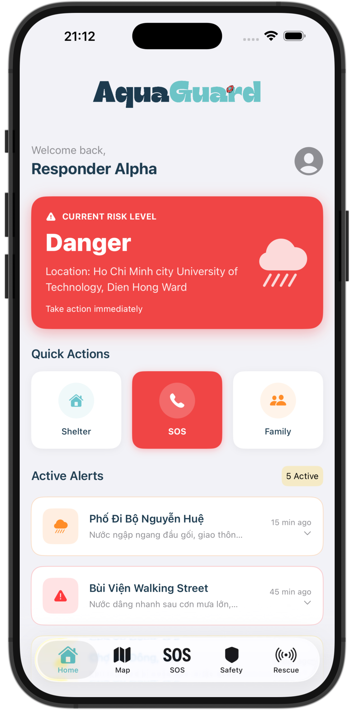
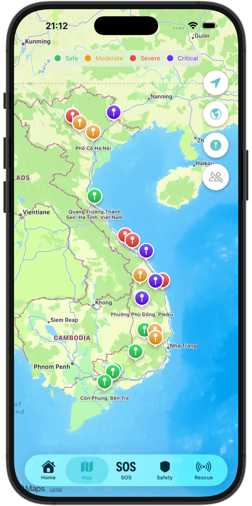
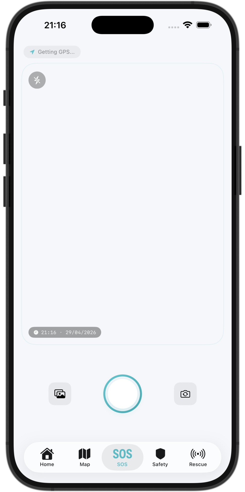
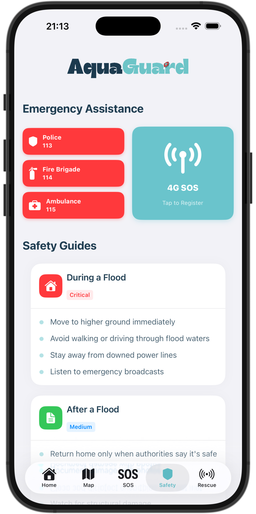
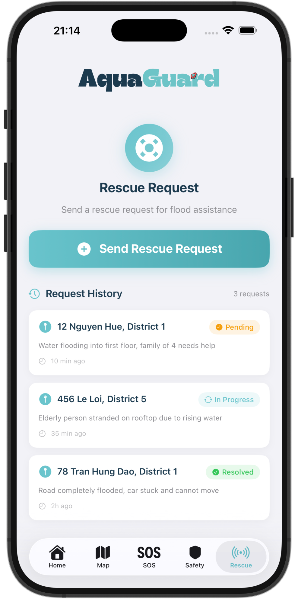
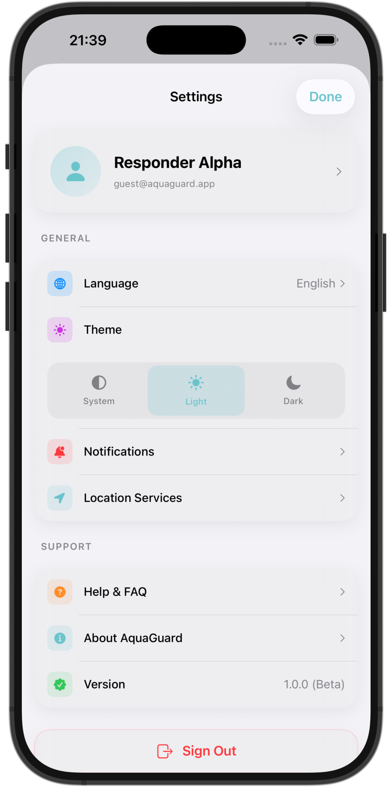
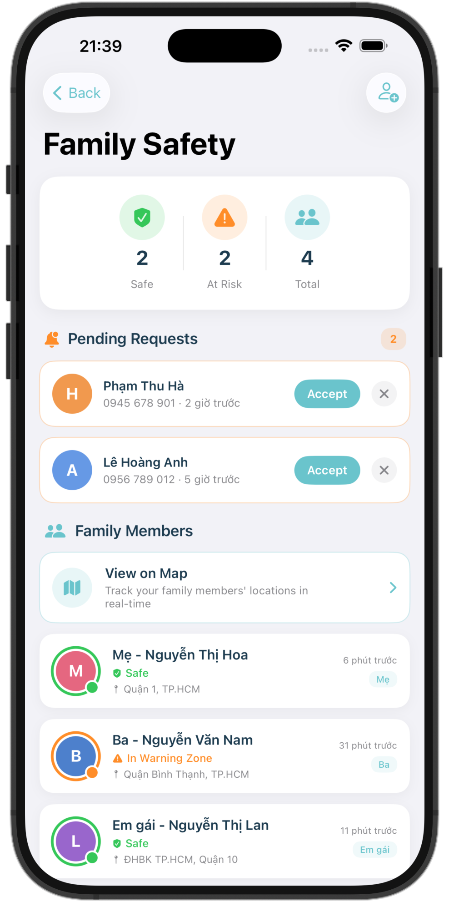
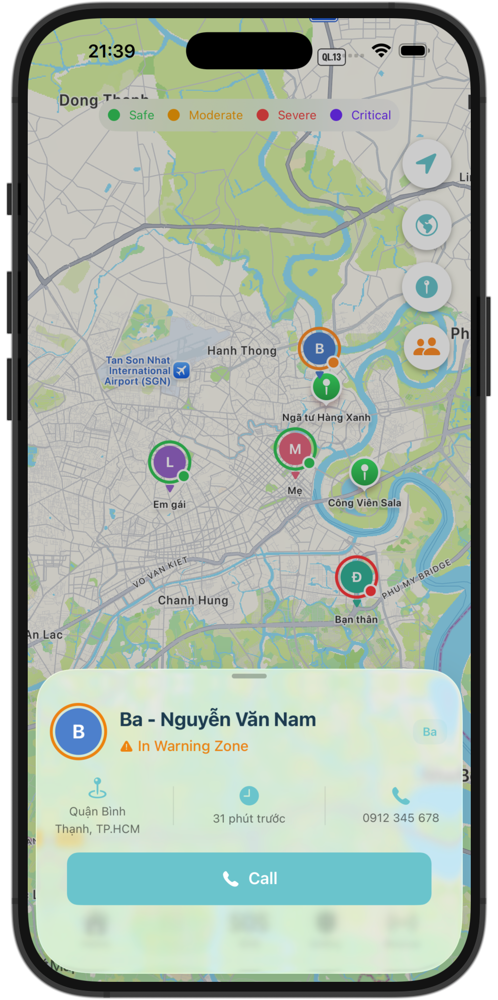
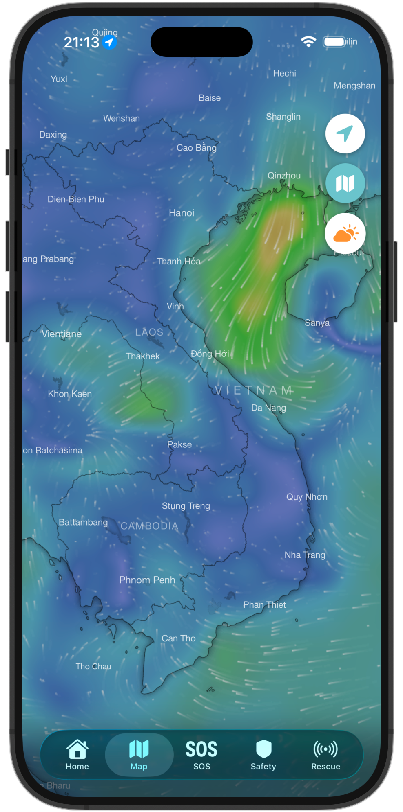

# 🌊 AquaGuard - Flood Alert & Rescue System


**AquaGuard** is a native iOS application built to help communities prepare for and respond to flood emergencies. The app combines live risk visibility, emergency tools, practical safety guidance, and community-driven incident reports in one place.

This repository contains the **iOS app**.  
We also maintain a **Web App version** here: [AquaGuard Web App Repository](https://github.com/your-org/AquaGuard-Web)

> **Status:** 🚧 MVP / Beta Development

---

## 📱 Screenshots

| Home | Map | Report |
|:---:|:---:|:---:|
|  |  |  |

| Safety | Rescue | Settings |
|:---:|:---:|:---:|
|  |  |  |

| Family | Family Info | Windy Map |
|:---:|:---:|:---:|
|  |  |  |

---

## ✨ Key Features

### 🚨 Real-Time Alerts
- **Risk Status Card:** Clear status levels (Safe / Warning / Danger) based on user context.
- **Live Notifications:** Receive rapid updates on heavy rain and flood-risk escalation.

### 🗺️ Interactive Flood Map
- **Location-Aware View:** Instantly jump to the current location using `CoreLocation`.
- **Severity Visualization:** Flood zones are color-coded for fast risk assessment:
  - 🟣 **Purple:** Critical (Emergency)
  - 🔴 **Red:** Severe (High Risk)
  - 🟠 **Orange:** Moderate (Caution)
  - 🟢 **Green:** Safe (Low Risk)
- **Zone Insights:** Tap a marker to inspect local flood depth and area details.

### 🆘 Safety & Emergency Connectivity
- **One-Tap 4G SOS:** Quickly activate emergency data package registration for major Vietnamese carriers.
- **Emergency Hotline Shortcuts:** Call Police (`113`), Fire Department (`114`), and Ambulance (`115`) directly.
- **Safety Guides:** Access concise flood survival instructions when every second matters.

### 📝 Community Reporting
- **Quick Incident Report:** Submit reports with location, water level, and photos.
- **Automatic Geolocation:** Capture coordinates automatically for better rescue coordination.

### ⛑️ Rescue Operations Dashboard
- **Resource Tracking:** Monitor rescue boats, shelters, and medical support capacity.
- **Mission Prioritization:** Review active requests and improve response allocation.

---

## 🛠 Tech Stack

- **Language:** Swift 5.9
- **UI Framework:** SwiftUI (MVVM Architecture)
- **Mapping:** MapKit + CoreLocation
- **Minimum iOS Version:** iOS 26.0+
- **Development Tools:** Xcode 16

---

## 🚀 Getting Started

### Prerequisites
- macOS Sonoma or later.
- Xcode 15 or newer.

### Installation
1. Clone this repository:
   ```bash
   git clone https://github.com/shynnguyen1004/AquaGuard-iOS.git
   ```
2. Open the project in Xcode:
   ```bash
   cd AquaGuard-iOS
   open AquaGuard.xcodeproj
   ```
3. Select your Development Team in **Signing & Capabilities**.
4. Build and run (`⌘ + R`) on Simulator or a real device.

---

## 🔮 Roadmap

- [x] SwiftUI MVP interface
- [x] Flood map with 4-level severity markers
- [x] Real-time location support
- [x] One-tap emergency connectivity flow
- [x] Community report form
- [ ] Backend integration (Supabase / Firebase)
- [ ] Offline-first reporting mode
- [ ] Push alerts for nearby danger zones
- [ ] AI-based flood trend prediction (NASA / NOAA data)

---

## 🤝 Contributing

Contributions are welcome.

1. Fork the project.
2. Create your feature branch (`git checkout -b feature/your-feature`).
3. Commit your changes (`git commit -m "Add your feature"`).
4. Push to your branch (`git push origin feature/your-feature`).
5. Open a Pull Request.

---

## 📄 License

Distributed under the MIT License. See `LICENSE` for details.

---

**Built with care for safer communities.**
